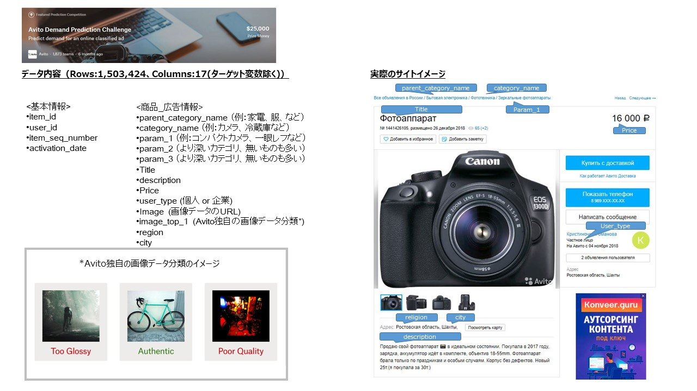
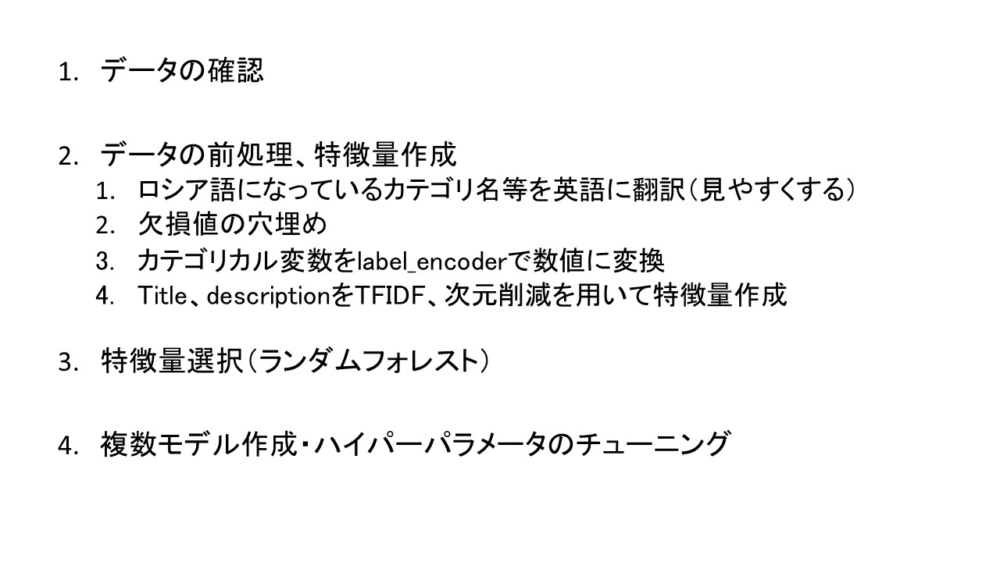
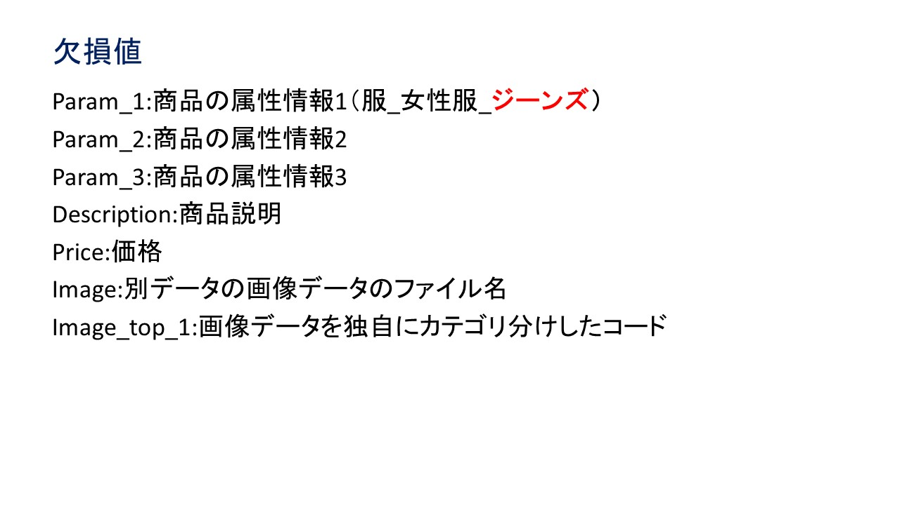
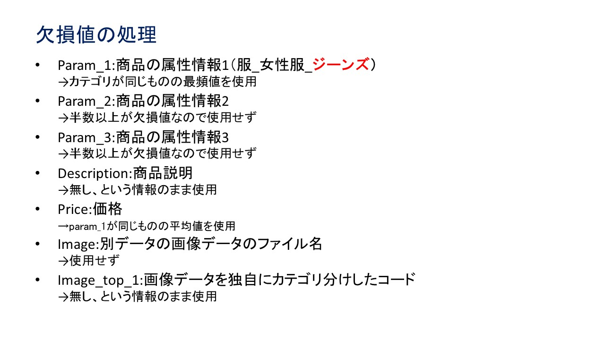
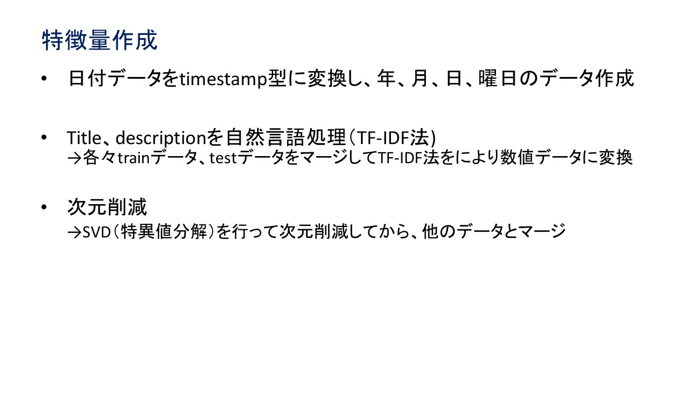
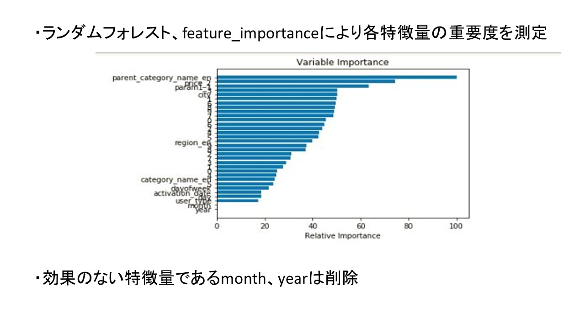

# Avito-Demand-Prediction-Challenge<br>
Avito（ロシアのCtoCオンライン売買プラットフォーム）上の出品広告の売買成約率予測<br>
## 1.使用データ <br>
Avito Demand Prediction Challenge<br>
https://www.kaggle.com/c/avito-demand-prediction<br>
<br>
<br>
## 2.分析の流れ <br>
<br>

## 3.データの確認 <br>

`.info()`でデータ内容確認
<br>

```<class 'pandas.core.frame.DataFrame'>
RangeIndex: 1503424 entries, 0 to 1503423
Data columns (total 18 columns):
item_id                 1503424 non-null object
user_id                 1503424 non-null object
region                  1503424 non-null object
city                    1503424 non-null object
parent_category_name    1503424 non-null object
category_name           1503424 non-null object
param_1                 1441848 non-null object
param_2                 848882 non-null object
param_3                 640859 non-null object
title                   1503424 non-null object
description             1387148 non-null object
price                   1418062 non-null float64
item_seq_number         1503424 non-null int64
activation_date         1503424 non-null object
user_type               1503424 non-null object
image                   1390836 non-null object
image_top_1             1390836 non-null float64
deal_probability        1503424 non-null float64
dtypes: float64(3), int64(1), object(14)
memory usage: 206.5+ MB

```

欠損値の多い`param_2、param_3`は使わない
他の欠損値の埋めていく<br>

## 4.データの前処理、特徴量作成 <br>
<br>
<br>
<br>

## 5.特徴量選択<br>
作成した学習データを使ってランダムフォレストにより特徴量の重要度をプロット<br>
<br>

## 6.LightGBMモデル作成
重要度の低い特徴を削除した学習データをLightGBMに学習させる<br>
Grid Searchを行いパラメータをチューニング<br>

